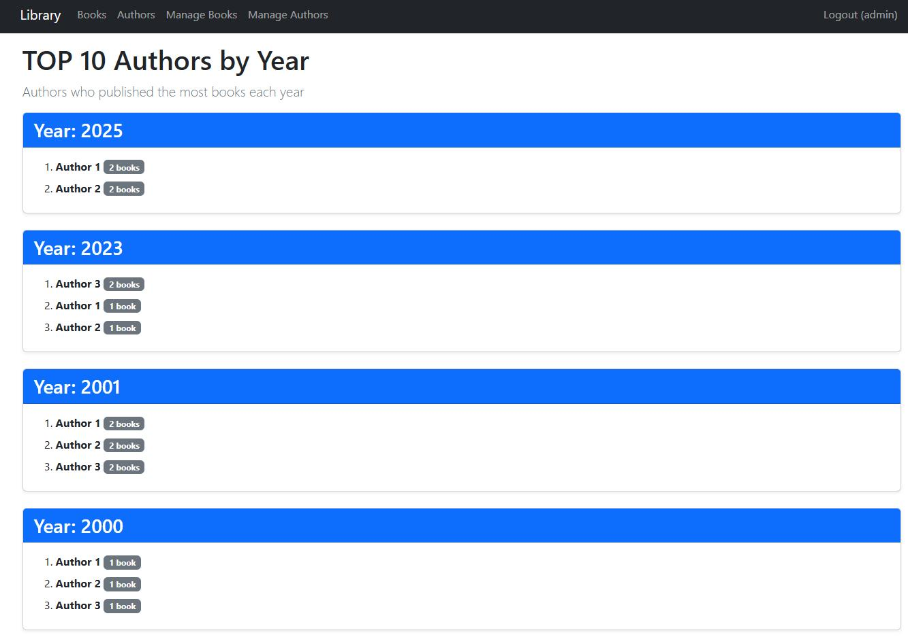
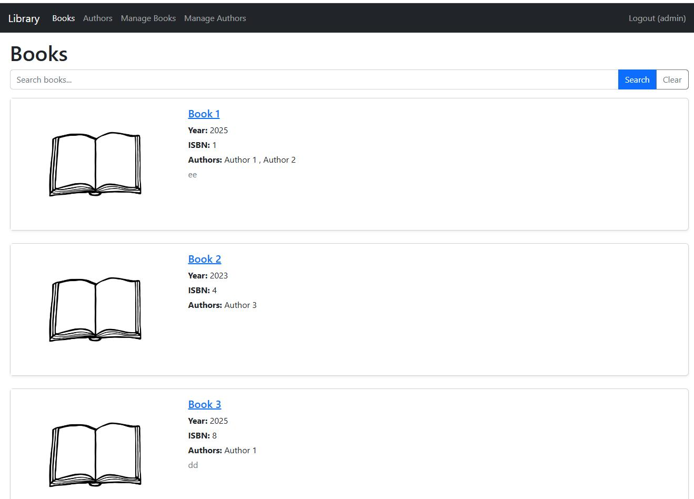
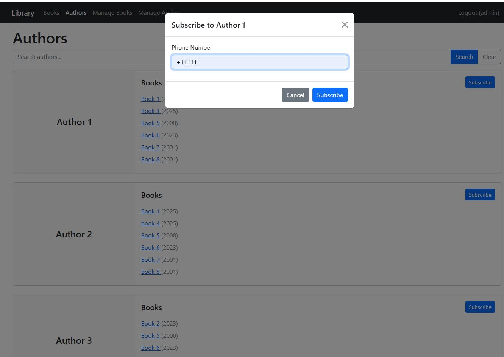
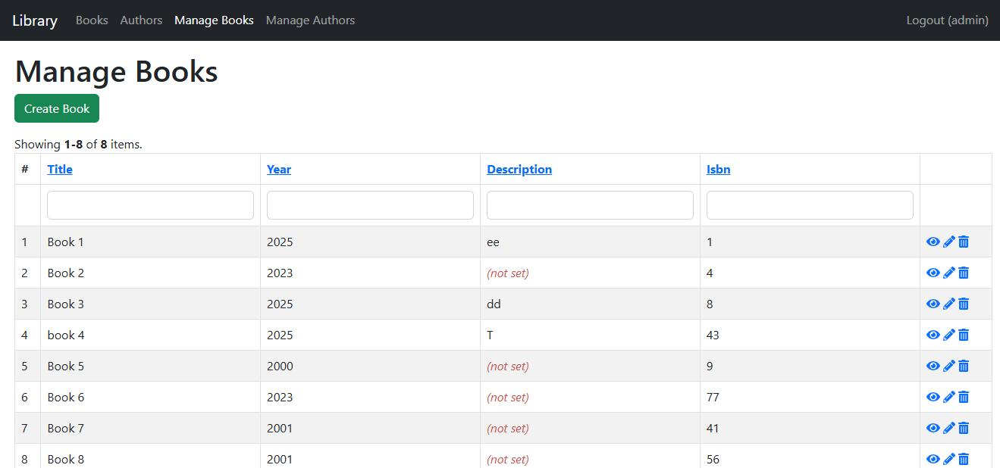
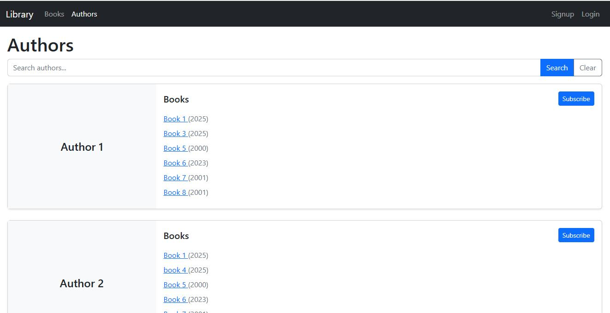

# Yii2 Book Catalog

Book catalog application built with Yii2 + MaridaDB.

## Task Requirements

Books can have multiple authors.

**Entities:**

1. Book - title, publication year, description, ISBN, cover photo
2. Author - full name

**Access Rights:**

1. Guest - view only + subscribe to new books by author
2. User - view, add, edit, delete

**Report:**

TOP 10 authors who published the most books in a given year (accessible to all users).

## Screenshots

### Homepage - TOP 10 Authors by Year

### Books Catalog

### Author Subscription

### Books Management (Authenticated)

### Login Page

